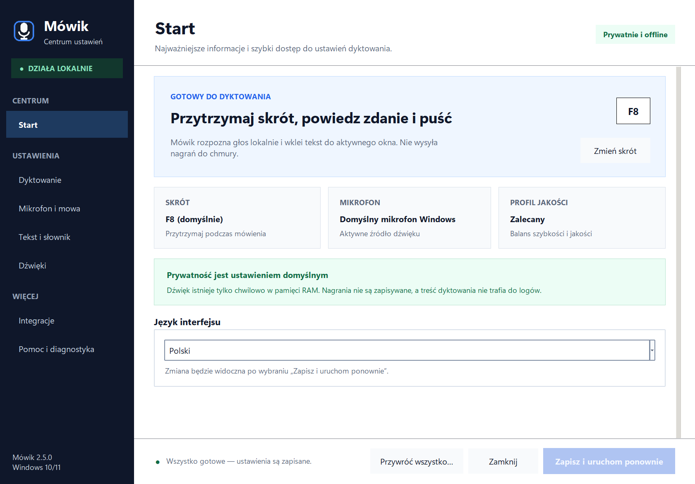
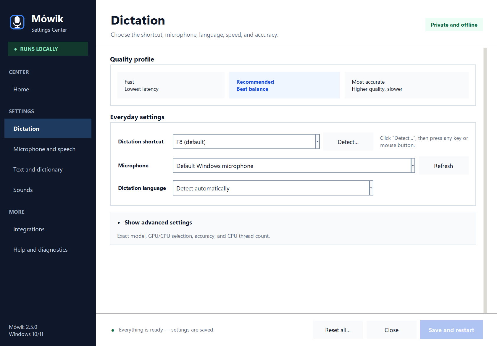
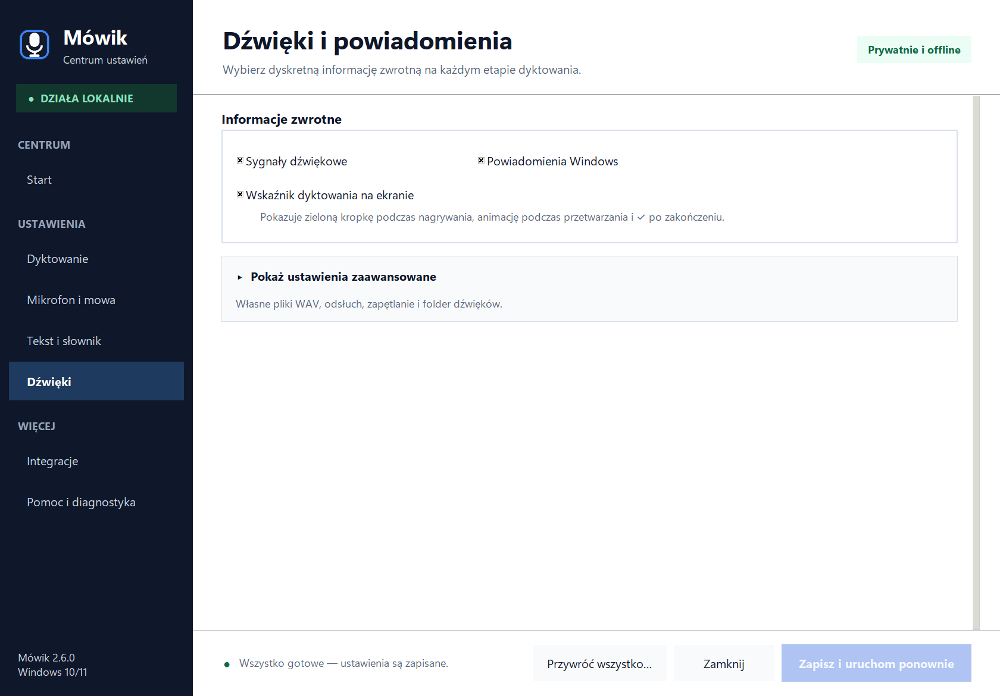
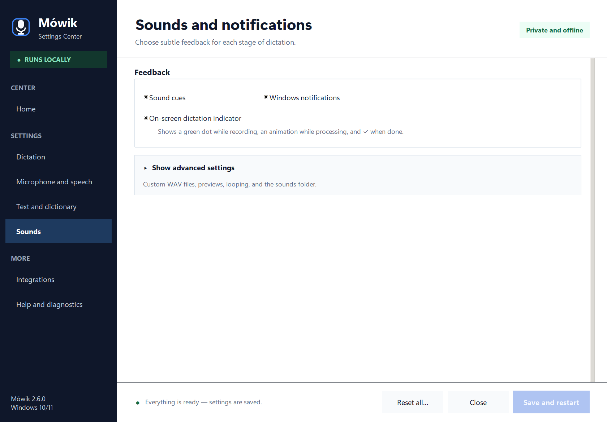

<div align="center">

# 🎤 Mówik

**Lokalne dyktowanie push-to-talk dla Windows 10/11**

[English](README.md) · **Polski**

[**Pobierz najnowszy instalator dla Windows**](https://github.com/Szunias/Mowik/releases/latest)

[](https://github.com/Szunias/Mowik/releases/latest)
[](LICENSE.txt)
[](https://www.python.org/)
[](#)
[](#prywatność)

Przytrzymaj klawisz, powiedz zdanie, puść klawisz. Lokalny model Whisper
zamienia mowę na tekst i wkleja go tam, gdzie właśnie piszesz.
Bez chmury, bez abonamentu i bez wysyłania głosu do internetu.

</div>

## Podgląd interfejsu

Centrum Mówika pokazuje na co dzień tylko najważniejsze ustawienia, a opcje techniczne przenosi do rozwijanych sekcji zaawansowanych. Kliknij dowolny podgląd, aby otworzyć go w pełnym rozmiarze.

<table>
  <tr>
    <td width="50%" align="center">
      <a href="assets/screenshots/mowik-home-pl.png">
        
      </a>
      <br><sub><strong>Ekran startowy</strong> · polski interfejs</sub>
    </td>
    <td width="50%" align="center">
      <a href="assets/screenshots/mowik-dictation-en.png">
        
      </a>
      <br><sub><strong>Dyktowanie i wydajność</strong> · angielski interfejs</sub>
    </td>
  </tr>
  <tr>
    <td width="50%" align="center">
      <a href="assets/screenshots/mowik-sounds-pl.png">
        
      </a>
      <br><sub><strong>Informacje zwrotne</strong> · polski interfejs</sub>
    </td>
    <td width="50%" align="center">
      <a href="assets/screenshots/mowik-sounds-en.png">
        
      </a>
      <br><sub><strong>Informacje zwrotne</strong> · angielski interfejs</sub>
    </td>
  </tr>
</table>

## Możliwości

- **Push-to-talk**: dyktujesz tylko wtedy, gdy trzymasz wybrany klawisz lub przycisk myszy.
- **W pełni lokalnie**: rozpoznawanie mowy (faster-whisper) działa na Twoim komputerze; po jednorazowym pobraniu modelu internet nie jest potrzebny.
- **Wykrywanie przycisku jednym kliknięciem**: wybierz `Wykryj…` i naciśnij dowolny klawisz albo przycisk myszy.
- **Czytelny panel ustawień** w zasobniku systemowym: na co dzień pokazuje tylko najważniejsze wybory, a model, GPU/CPU, VAD i szczegóły połączeń są dostępne na żądanie w **ustawieniach zaawansowanych**.
- **Polski i angielski interfejs** z automatycznym dopasowaniem do języka Windows oraz trwałym przełącznikiem języka.
- **Łagodne sygnały wbudowane i własne dźwięki WAV** dla startu nagrywania, puszczenia przycisku, gotowego tekstu i błędu, z odsłuchem i opcjonalnym zapętleniem.
- **Opcjonalny ekranowy wskaźnik dyktowania** z zieloną kropką nagrywania, animacją przetwarzania, znacznikiem sukcesu i symbolem X przy błędzie.
- **Własne komendy w stylu Jarvisa** pod osobnym przyciskiem: wklejanie zapisanych treści, otwieranie programu/pliku/strony albo bezpieczne otwarcie terminala w folderze aktywnego Eksploratora ze szkicem w schowku.
- **Elastyczne wyjście**: automatyczne wklejanie do aktywnego okna, kopiowanie do schowka albo jedno i drugie.
- **Prywatny słownik**: nazwiska, marki i fachowe terminy jako podpowiedź dla modelu.
- **Bufor sprzed naciśnięcia**: pierwsza sylaba nie jest ucinana, bo mikrofon trzyma krótki bufor w pamięci RAM.
- **Opcjonalna korekta LLM** przez lokalną Ollamę (domyślnie wyłączona).

## Jak to działa

1. Mikrofon utrzymuje krótki bufor dźwięku wyłącznie w pamięci RAM.
2. Po puszczeniu przycisku lokalny model **Whisper** rozpoznaje wypowiedź.
3. Opcjonalnie lokalny LLM (Ollama) może bardzo zachowawczo poprawić zapis.
4. Wynik trafia do aktywnego okna i/lub do schowka, zgodnie z ustawieniami.

Żadne nagranie nie jest zapisywane na dysku, a log techniczny nie zawiera treści dyktowanych zdań.

## Szybki start

### Świeża instalacja

1. Pobierz `Mowik-x.y.z-Setup-UNSIGNED.exe` z [najnowszego wydania](https://github.com/Szunias/Mowik/releases/latest).
2. Uruchom plik i przejdź przez krótki kreator. Nie potrzebujesz Pythona ani ręcznego rozpakowywania plików.
3. Zostaw zaznaczone **Uruchom Mówika** i kliknij **Zakończ**.
4. Przytrzymaj **F8**, powiedz zdanie i puść klawisz.

Instalator wymaga 64-bitowego Windows 10 w wersji 1809 lub nowszej albo Windows 11. Działa bez uprawnień administratora, dodaje Mówika do menu Start i tworzy normalny wpis w **Ustawienia → Aplikacje**. Opcjonalnie może dodać skrót na pulpicie i uruchamiać program po zalogowaniu. Pierwszy start jednorazowo pobiera lokalny model mowy do `%LOCALAPPDATA%\Mowik\models`; później rozpoznawanie działa offline.

Instalator proponuje język zgodny z interfejsem Windows i pozwala go potwierdzić lub zmienić. Aplikacja domyślnie dopasowuje język automatycznie; w Centrum Mówika możesz niezależnie wybrać **Automatycznie**, **Polski** albo **English**, a następnie **Zapisz i uruchom ponownie**.

> [!WARNING]
> Publiczny instalator Mówika 2.7.1 **nie jest podpisany cyfrowo**. Windows może przez to wyświetlić komunikat **Nieznany wydawca** albo ostrzeżenie Microsoft Defender SmartScreen. Pobieraj instalator wyłącznie z [oficjalnego wydania Mówika na GitHubie](https://github.com/Szunias/Mowik/releases/latest) i przed uruchomieniem porównaj jego SHA-256 z plikiem `SHA256SUMS.txt` z tego samego wydania. W PowerShell użyj `Get-FileHash .\Mowik-2.7.1-Setup-UNSIGNED.exe -Algorithm SHA256` i porównaj całą wartość. Nie wyłączaj zabezpieczeń Windows, żeby zainstalować Mówika.

### Aktualizacja istniejącej instalacji

Pobierz nowszy `Mowik-x.y.z-Setup-UNSIGNED.exe` i uruchom go. Instalator rozpozna poprzednią wersję, zamknie ją na czas aktualizacji i podmieni tylko pliki programu. Konfiguracja, słownik, własne dźwięki i pobrane modele zostają na miejscu.

Jeśli przechodzisz ze starej wersji ZIP 2.2.0 lub wcześniejszej, również użyj nowego instalatora. Istniejące dane z AppData zostaną wykorzystane automatycznie, a instalator usunie stary skrót autostartu. Po sprawdzeniu nowej wersji możesz ręcznie usunąć dawny folder z `.venv`.

## Centrum Mówika

Kliknij prawym przyciskiem ikonę mikrofonu przy zegarze Windows (czasem pod strzałką **Pokaż ukryte ikony**) i wybierz **Panel ustawień…**. Centrum Mówika ma ekran startowy z aktywnym skrótem, mikrofonem i profilem jakości oraz boczną nawigację do pozostałych opcji. Parametry techniczne są schowane w rozwijanych **ustawieniach zaawansowanych**, dlatego domyślny widok zawiera tylko decyzje potrzebne na co dzień.

| Sekcja | Zawartość |
|---|---|
| Start | aktywny skrót, mikrofon, profil jakości, język interfejsu i najważniejsze informacje o prywatności |
| Dyktowanie | profil jakości, przycisk, mikrofon i język; model, GPU/CPU, dokładność i wątki w ustawieniach zaawansowanych |
| Mikrofon i mowa | automatyczne wykrywanie mowy; bufory, czułość i szczegóły ciszy w ustawieniach zaawansowanych |
| Tekst i słownik | wklejanie, kopiowanie, końcowa spacja, komendy głosowe i prywatny słownik |
| Własne komendy | osobny skrót, wypowiadane frazy, szablony tekstu, otwieranie programów/plików/stron i bezpieczne szkice „terminal tutaj” |
| Dźwięki | sygnały i powiadomienia; własne WAV-y, odsłuch i zapętlenie w ustawieniach zaawansowanych |
| Integracje | opcjonalny lokalny korektor LLM przez Ollamę, ze szczegółami połączenia w ustawieniach zaawansowanych |
| Pomoc i diagnostyka | najpierw bezpieczny log i folder danych; `config.json` w ustawieniach zaawansowanych |

Kolorowa plakietka ikony w zasobniku pokazuje bieżący stan: gotowość, nagrywanie, przetwarzanie albo błąd.

### Zbindowanie dowolnego przycisku

W sekcji **Dyktowanie** kliknij **Wykryj…**, zaczekaj na napis „Nasłuchuję” i naciśnij wybrany klawisz albo przycisk myszy. `Esc` anuluje. Najwygodniejsze są klawisze F6-F12, Pause/Break, Scroll Lock oraz boczne przyciski myszy X1/X2.

## Szybkie profile

Dostępne z menu ikony w zasobniku (**Szybki profil**):

| Profil | Model | Dokładność | Zastosowanie |
|---|---|---:|---|
| Szybki | `small` | 1 | słabszy komputer, najmniejsze opóźnienie |
| Zalecany | `large-v3-turbo` | 2 | najlepszy kompromis szybkości i jakości |
| Najdokładniejszy | `large-v3` | 5 | najwyższa jakość kosztem czasu i ok. 3,1 GB na dysku |

Wybranie modelu, którego nie ma jeszcze na dysku, uruchamia jego jednorazowe pobranie. Na samym CPU najlepiej zacząć od profilu **Zalecany**; pełny `large-v3` bywa wtedy wyraźnie wolniejszy.

## Schowek i wklejanie

Dwa niezależne ustawienia w sekcji **Tekst i słownik**:

| Wklejanie | Schowek | Zachowanie |
|---|---|---|
| włączone | włączony | tekst zostaje wklejony i skopiowany |
| włączone | wyłączony | tekst jest wpisywany bez zmiany schowka |
| wyłączone | włączony | tekst trafia tylko do schowka |

Nie można wyłączyć obu opcji naraz. Gdy kopiowanie jest włączone, schowek zawiera dokładną transkrypcję; opcjonalna końcowa spacja jest wysyłana osobno do aktywnego okna i nie trafia do kopiowanego tekstu.

## Informacje zwrotne i własne dźwięki

Opcjonalny **Wskaźnik dyktowania na ekranie** w sekcji **Dźwięki → Informacje zwrotne** daje natychmiastowe potwierdzenie wizualne bez odbierania fokusu aplikacji, w której piszesz. Zwykłe dyktowanie ma zieloną kropkę, a własne komendy — wyraźnie odmienny fioletowy wskaźnik. Oba tryby mają własną animację przetwarzania i znacznik sukcesu; przy błędzie pojawia się symbol X. Wskaźnik można wyłączyć w ustawieniach Mówika; sygnały dźwiękowe i powiadomienia Windows konfiguruje się niezależnie.

W sekcji **Dźwięki** rozwiń **ustawienia zaawansowane**, aby przypisać osobny plik do każdego zdarzenia: naciśnięcie, puszczenie, gotowy tekst, błąd. Obsługiwane są nieskompresowane pliki `.wav` (PCM) do 50 MB. Po zapisaniu plik jest kopiowany do `%APPDATA%\Mowik\sounds`, więc działa nawet po usunięciu oryginału. Pole pokazuje **Wbudowany**, gdy działa krótki ton programu; przycisk **Przywróć** wraca do tego dźwięku.

## Słownik nazw i terminów

Wybierz **Tekst i słownik**, potem **Edytuj słownik…** i wpisuj jedną frazę w wierszu:

```text
Kowalski
Żyrardów
PostgreSQL
Mówik
```

Słownik jest przekazywany modelowi jako podpowiedź. Pomaga przy nazwiskach, markach i skrótach, ale nie gwarantuje konkretnego zapisu w 100%.

## Komendy głosowe

Po włączeniu w sekcji **Tekst i słownik** rozpoznawane są komendy „nowa linia” i „nowy akapit” dla polskiego oraz `new line` i `new paragraph` dla angielskiego. Domyślnie są wyłączone, aby zwykłe zdania z tymi słowami nie były zamieniane.

## Własne komendy i akcje

Własne komendy używają drugiego przycisku push-to-talk — domyślnie **F7** — a **F8** pozostaje zwykłym dyktowaniem. W sekcji **Własne komendy** dodaj wypowiadaną frazę i wybierz jedną z trzech akcji:

- **Wklej tekst** — wstaw zapisany fragment dokładnie. Tekst wielowierszowy zawsze wymaga potwierdzenia, bo wklejony do terminala mógłby coś wykonać.
- **Otwórz program, plik lub stronę** — uruchom istniejącą bezwzględną ścieżkę lokalną albo adres HTTPS; potwierdzenie jest zawsze wymagane, a skrypty, skróty i ścieżki sieciowe są blokowane.
- **Otwórz terminal** — uruchom Windows Terminal albo widoczną klasyczną konsolę w folderze przechwyconym z aktywnego Eksploratora, w wybranym stałym folderze lub w folderze domowym.

Polecenia terminala celowo działają jako szkic. Komenda może dopasować wyłącznie pełną frazę i tylko otworzyć terminal albo potraktować resztę wypowiedzi jako jednowierszowy szkic. Mówik sprawdza go, kopiuje do schowka i nigdy nie wpisuje go automatycznie ani nie naciska Enter. To Ty przeglądasz tekst, wklejasz go przez `Ctrl+V` i samodzielnie uruchamiasz. Dowolne wykonywanie zapisanych poleceń przez `cmd.exe` oraz stare wpisy `run_command` są wyłączone.

Wklejanie i otwieranie używa dokładnego dopasowania całej frazy. Szkic terminala ma jawny tryb fraza-plus-reszta: fraza musi znaleźć się na początku i kończyć na granicy pełnego słowa, a przy kilku możliwościach wygrywa najdłuższa. Nie ma rozmytego ani częściowego uruchamiania. Jeżeli aktywny Eksplorator pokazuje lokalizację wirtualną, ścieżkę sieciową, nieistniejący folder albo nie można go jednoznacznie rozpoznać, akcja jest blokowana bez zastępczego katalogu.

Mówik zapamiętuje tożsamość okna Eksploratora w chwili naciśnięcia F7, a nie dopiero po transkrypcji. Otwieranie programów i terminala jest też blokowane, gdy Mówik działa jako administrator, aby proces potomny nie odziedziczył po cichu podwyższonych uprawnień. Wielowierszowe akcje wklejania mają ograniczoną długość, dzięki czemu okno potwierdzenia pokazuje całą treść. Frazy oraz treści pozostają lokalnie jako jawny tekst w `%APPDATA%\Mowik\config.json`; nie zapisuj w nich haseł, tokenów ani sekretów.

Fioletowy wskaźnik ekranowy odróżnia komendy od zwykłego zielonego dyktowania. Ma własną animację przetwarzania i znacznik sukcesu; można go wyłączyć w **Dźwięki → Informacje zwrotne**.

### Przejrzystość wobec antywirusa i SmartScreen

Mówik nie zaciemnia kodu, nie wyłącza ochrony, nie dodaje wyjątków Defendera, nie ukrywa konsol poleceń i nie pobiera wykonywalnych aktualizacji. Build Windows jest katalogiem aplikacji zamiast samorozpakowującego się pojedynczego EXE, ma manifest `asInvoker`, pozostawia autostart jako świadomy wybór i nie wykonuje szkiców terminala. To ogranicza podejrzane zachowania, ale nie zastępuje podpisu Authenticode ani normalnego budowania reputacji. Publiczny instalator 2.7.1 jest niepodpisany, więc komunikat Nieznany wydawca albo ostrzeżenie SmartScreen może wystąpić nawet wtedy, gdy SHA-256 zgadza się z oficjalnym wydaniem. Jeżeli antywirus zgłosi zweryfikowany oficjalny plik, prześlij dokładnie ten plik jako możliwy fałszywy alarm zamiast osłabiać zabezpieczenia użytkownika.

Samo rozpoznawanie mowy nadal działa lokalnie, ale akcja otwierająca stronę lub program korzystający z sieci może oczywiście użyć połączenia internetowego tego programu.

## Opcjonalna korekta LLM (Ollama)

Ollama nie jest potrzebna do rozpoznawania mowy. Może jedynie poprawić interpunkcję i oczywiste literówki po transkrypcji:

1. Zainstaluj Ollamę osobno i pobierz w niej wybrany model.
2. W sekcji **Integracje** zaznacz korektę i wpisz nazwę pobranego modelu.

Korektor odrzuca wynik, gdy zbyt mocno zmienia tekst, liczby albo negacje. Przy tekstach prawnych, medycznych i finansowych najlepiej zostawić go wyłączonego.

## Prywatność

- Dźwięk jest przechowywany tylko chwilowo w pamięci RAM; nagrania nie są zapisywane.
- Log techniczny nie zawiera treści dyktowanych zdań.
- Frazy i zawartość własnych komend nie trafiają do logu technicznego, ale są lokalnie zapisane w `config.json`, aby można je było edytować.
- Transkrypcja działa lokalnie; po pobraniu modelu internet nie jest potrzebny.
- Ollama, jeżeli ją włączysz, jest wywoływana pod lokalnym adresem `127.0.0.1`.

Mikrofon pozostaje otwarty podczas działania programu, aby utrzymać krótki bufor sprzed naciśnięcia klawisza. Dzięki temu pierwsza i ostatnia sylaba są rzadziej ucinane. Bufor nie jest zapisywany na dysku.

## Dokładność i wydajność

Wartość modelu `auto` wybiera niskoopóźnieniowy `large-v3-turbo` zarówno na GPU, jak i CPU. Pełny `large-v3` pozostaje w profilu **Najdokładniejszy**. Model jest najpierw ładowany wyłącznie z lokalnego cache, więc po jego pobraniu start aplikacji nie zależy od odpowiedzi serwera Hugging Face. Najlepsze wyniki dają: mikrofon blisko ust, ciche otoczenie, język `pl`, własny słownik oraz krótkie, wyraźne wypowiedzi. Żaden system rozpoznawania mowy nie gwarantuje 100% poprawności.

Instalator zawiera własny runtime CUDA 12.9, cuBLAS i cuDNN, dzięki czemu Mówik nie zależy od bibliotek dołączonych przez inne programy. Zgodna karta NVIDIA jest wybierana automatycznie; przetwarzanie CUDA używa `float16`, a automatyczny fallback CPU — `int8`. Dołączony runtime CUDA obsługuje również karty RTX serii 50. Jeżeli test encodera GPU się nie powiedzie, Mówik zapisuje szczegóły w logu i kontynuuje pracę na CPU. W trybie CPU liczba wątków `0` oznacza automatyczny dobór do liczby rdzeni fizycznych, maksymalnie 16.

## Diagnostyka i pliki

| Co | Gdzie |
|---|---|
| Panel ustawień | menu Start → **Mówik → Centrum Mówika** |
| Urządzenia audio | **Centrum Mówika → Dyktowanie → Mikrofon** |
| Log | `%LOCALAPPDATA%\Mowik\mowik.log` |
| Konfiguracja | `%APPDATA%\Mowik\config.json` |
| Słownik | `%APPDATA%\Mowik\slownik.txt` |
| Dźwięki | `%APPDATA%\Mowik\sounds` |
| Modele | `%LOCALAPPDATA%\Mowik\models` |

Mówik nie wklei tekstu do aplikacji uruchomionej jako administrator, jeżeli sam nie działa jako administrator. To zabezpieczenie Windows dotyczące symulowania klawiatury między procesami o różnych uprawnieniach.

## Naprawa, autostart i budowanie

- Ponowne uruchomienie tego samego instalatora naprawia pliki programu bez usuwania danych użytkownika.
- Autostart jest domyślnie odznaczony i wymaga świadomego zaznaczenia w kreatorze; ponowne uruchomienie instalatora pozwala zmienić tę opcję.
- Język interfejsu może automatycznie podążać za językiem Windows albo zostać ustawiony na polski lub angielski w Centrum Mówika.
- `BUDUJ_EXE.cmd` buduje katalog aplikacji `dist\Mowik`.
- `BUDUJ_INSTALATOR.cmd` uruchamia testy, buduje aplikację i tworzy jednoznacznie lokalny `release\Mowik-x.y.z-Setup-UNSIGNED.exe` wraz z sumą SHA-256. Doraźnego lokalnego buildu nie należy wgrywać jako oficjalnego wydania. Oficjalne artefakty powstają przez workflow wydania na GitHubie razem z `SHA256SUMS.txt`; publiczny instalator 2.7.1 również jest niepodpisany i może wywołać ostrzeżenia Windows.
- Definicje powtarzalnego wydania znajdują się w `packaging`, a workflow GitHub Actions w `.github/workflows/windows-release.yml`.

## Licencja

Kod Mówika jest dostępny na licencji [MIT](LICENSE.txt). Biblioteki i modele zachowują własne licencje; najważniejsze informacje są zebrane w [THIRD_PARTY_NOTICES.txt](THIRD_PARTY_NOTICES.txt).
